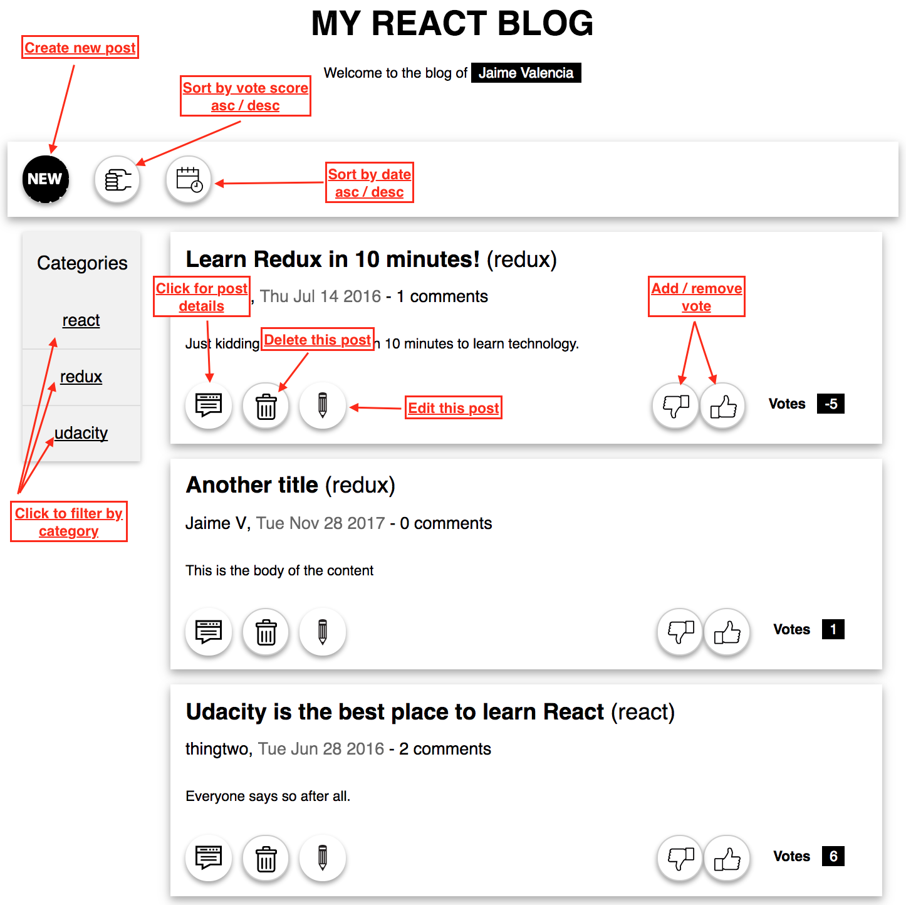
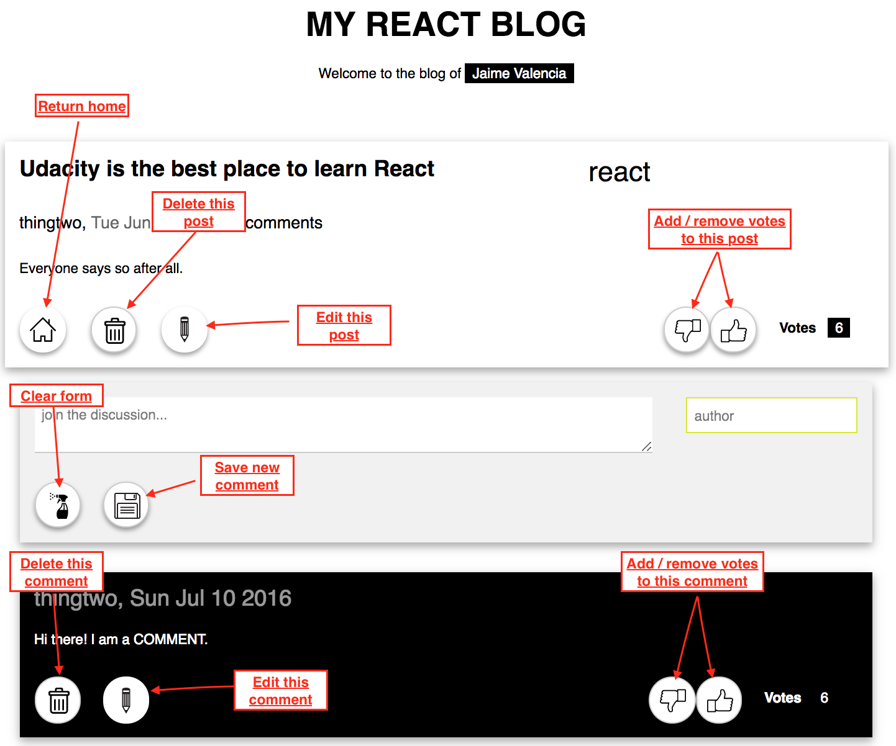
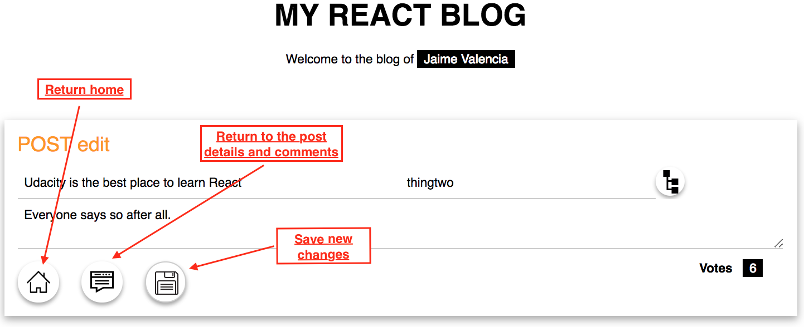
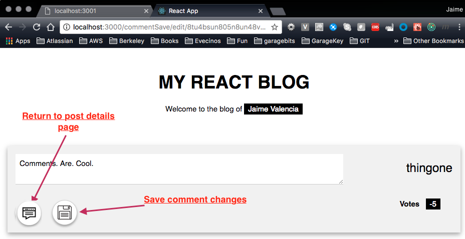

# Readable
---

## Project:

Second project for REACT Udacity nanodegree. Shows how to use redux and react together.

Users will be able to post content to predefined categories, comment on their posts and other users' posts, and vote on posts and comments. Users will also be able to edit and delete posts and comments

## How to...
The project uses Node.js and the "Project Readable API Server" project as server using 3001 port.  You MUST have NODEJS installed already in your computer

Go to the directory where you want to store the app
```
git clone https://github.com/vaduinc/reactnd-project-readable.git
```
The project contains 2 modules; api-server and front-end, each of them in their respective subfolders;
go to the api-server subfolder and run the commands
```
nmp install
node server
```
Then go up one folder level and get into the frontend subfolder 
and run the following commands;
```
nmp install
npm start
```

You browser should open automatically using http://localhost:3000 URL.
Navigate the application using the following descriptions from the home page, see next picture



```diff
Post details page
```



```diff
Add or edit Post
```



```diff
Edit comment
```



### Resources:
* [Project Readable API Server](reactnd-project-readable-starter)
* [React-alert npm ](https://www.npmjs.com/package/react-alert)
* [Icon images](http://www.freepik.com)
* [CSS template](https://www.w3schools.com/w3css/w3css_templates.asp)